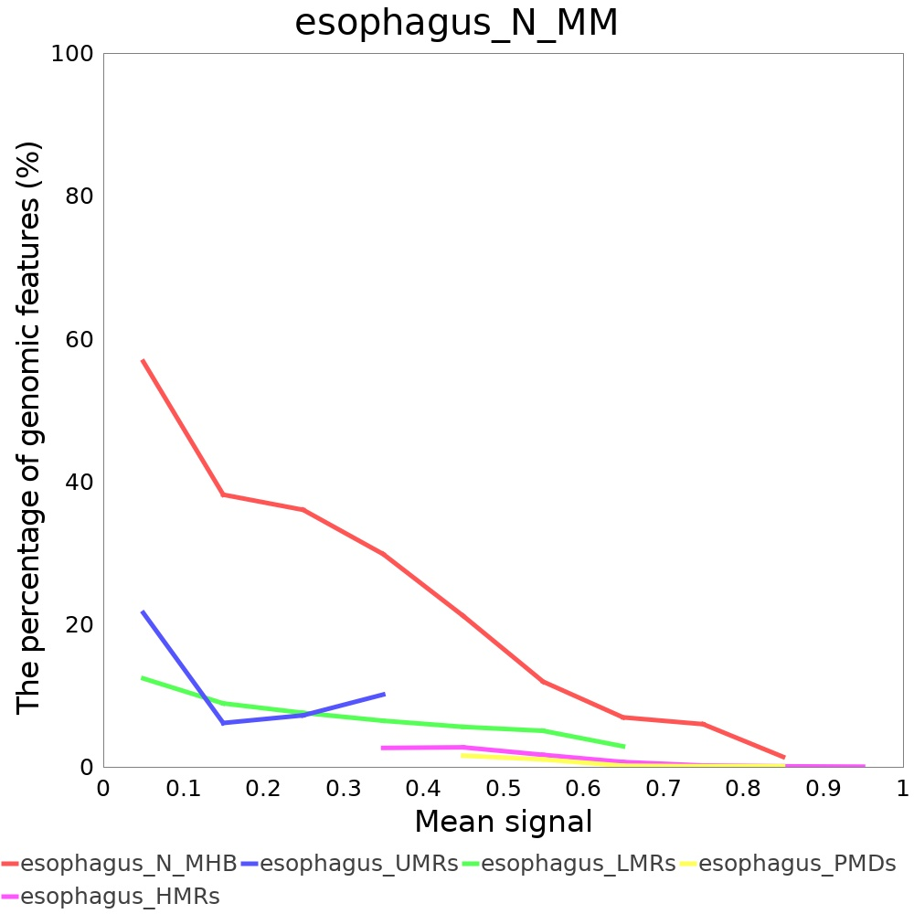

***

# Abstract
Bisulfite sequencing (BS-seq) remains the gold standard technique to detect DNA methylation profiles at single-nucleotide resolution. The DNA methylation status of CpG sites on the same fragment represents a discrete methylation haplotype (mHap). The mHap-level metrics were demonstrated to be promising cancer biomarkers and explain more gene expression variation than average methylation. However, most existing tools focus on average methylation and neglect mHap patterns. Previously, we have developped [mHapTk](https://github.com/CCCKW/mHapTk), a comprehensive toolkit for the analysis of DNA methylation haplotypes. Here, we present mHapSuite, a Java reimplementation of mHapTk for the analysis of mhaps. mHapSuite shows significant improvment in terms of both functionality and efficiency.

# Installation
It is written in Java, and should run in Windows, Linux and macOS with java 1.8 installed. The source code of mHapSuite is hosted in [github](https://github.com/yoyoong/mHapSuite) and the jar file is ready to use.

# Testing Datasets

## mHap files
| Accession Number | Description | mHap | index |
| ----: | :------------: | :------- | :------- |
| GSE149608  | esophageal squamous cell carcinoma <br> (Pool of 10 samples) | [esophagus_T.mhap.gz](http://bioinformatics.sibcb.ac.cn/dataupload/DataSets/ESCC/mHap/esophagus_T.mhap.gz) | [esophagus_T.mhap.gz.tbi](http://bioinformatics.sibcb.ac.cn/dataupload/DataSets/ESCC/mHap/esophagus_T.mhap.gz.tbi) |
| GSE149608  | adjacent normal esophageal tissue <br> (Pool of 10 samples)  | [esophagus_N.mhap.gz](http://bioinformatics.sibcb.ac.cn/dataupload/DataSets/ESCC/mHap/esophagus_N.mhap.gz) | [esophagus_N.mhap.gz.tbi](http://bioinformatics.sibcb.ac.cn/dataupload/DataSets/ESCC/mHap/esophagus_N.mhap.gz.tbi) |
| GSM4505856 | adjacent normal esophageal tissue | [SRX8208802.mhap.gz](http://bioinformatics.sibcb.ac.cn/dataupload/DataSets/ESCC/mHap/SRX8208802.mhap.gz) | [SRX8208802.mhap.gz.tbi](http://bioinformatics.sibcb.ac.cn/dataupload/DataSets/ESCC/mHap/SRX8208802.mhap.gz.tbi) |

## BED files
| File name | Description | Download |
| ----: | :------------------------: | :------- |
| ESCC_Hyper_Promoter.BED| Promoters (-1 kb to 1 kb) that overlap with hyper-DMRs in ESCC (GSE149608) | [Download](http://bioinformatics.sibcb.ac.cn/dataupload/DataSets/ESCC/BED/ESCC_Hyper_Promoter.BED) |
| ESCC_Hypo_Promoter.BED | Promoters (-1 kb to 1 kb) that overlap with hypo-DMRs in ESCC (GSE149608) | [Download](http://bioinformatics.sibcb.ac.cn/dataupload/DataSets/ESCC/BED/ESCC_Hypo_Promoter.BED)  |
|esophagus_UMRs.bed      | UMRs called from normal esophagus tissues                                 | [Download](http://bioinformatics.sibcb.ac.cn/dataupload/DataSets/ESCC/BED/esophagus_UMRs.bed)      |
|esophagus_LMR.bed       | LMRs called from normal esophagus tissues                                  | [Download](http://bioinformatics.sibcb.ac.cn/dataupload/DataSets/ESCC/BED/esophagus_LMR.bed)       |
|esophagus_PMDs.bed      | PMDs called from normal esophagus tissues                                  | [Download](http://bioinformatics.sibcb.ac.cn/dataupload/DataSets/ESCC/BED/esophagus_PMDs.bed)      |
|esophagus_HMRs.bed      | HMRs called from normal esophagus tissues                                  | [Download](http://bioinformatics.sibcb.ac.cn/dataupload/DataSets/ESCC/BED/esophagus_HMRs.bed)      |
|esophagus_T_MHB.bed     | MHBs called form esophagus 10 tumor samples (GSE149608)                    | [Download](http://bioinformatics.sibcb.ac.cn/dataupload/DataSets/ESCC/BED/esophagus_T_MHB.bed)     |
|esophagus_N_MHB.bed     | MHBs called from esophagus 10 normal samples (GSE149608)                   | [Download](http://bioinformatics.sibcb.ac.cn/dataupload/DataSets/ESCC/BED/esophagus_N_MHB.bed)     |
|esophagus_open.bed      | Open chromatin regions called from normal esophagus tissues                | [Download](http://bioinformatics.sibcb.ac.cn/dataupload/DataSets/ESCC/BED/esophagus_open.bed)      |

## BigWig files
| Metric |       Tumor BigWig file    |      Normal BigWig file   |
| -----: | :------------------------: | :------------------------ |
| Mean methylation | [esophagus_T_MM.bw](http://bioinformatics.sibcb.ac.cn/dataupload/DataSets/ESCC/bw/esophagus_T_MM.bw) | [esophagus_N_MM.bw](http://bioinformatics.sibcb.ac.cn/dataupload/DataSets/ESCC/bw/esophagus_N_MM.bw)   |
| PDR              | [esophagus_T_PDR.bw](http://bioinformatics.sibcb.ac.cn/dataupload/DataSets/ESCC/bw/esophagus_T_PDR.bw) | [esophagus_N_PDR.bw](http://bioinformatics.sibcb.ac.cn/dataupload/DataSets/ESCC/bw/esophagus_N_PDR.bw) |
| CHALM            | [esophagus_T_CHALM.bw](http://bioinformatics.sibcb.ac.cn/dataupload/DataSets/ESCC/bw/esophagus_T_CHALM.bw) | [esophagus_N_CHALM.bw](http://bioinformatics.sibcb.ac.cn/dataupload/DataSets/ESCC/bw/esophagus_N_CHALM.bw) |
| MHL              | [esophagus_T_MHL.bw](http://bioinformatics.sibcb.ac.cn/dataupload/DataSets/ESCC/bw/esophagus_T_MHL.bw) | [esophagus_N_MHL.bw](http://bioinformatics.sibcb.ac.cn/dataupload/DataSets/ESCC/bw/esophagus_N_MHL.bw) |
| MBS              | [esophagus_T_MBS.bw](http://bioinformatics.sibcb.ac.cn/dataupload/DataSets/ESCC/bw/esophagus_T_MBS.bw) | [esophagus_N_MBS.bw](http://bioinformatics.sibcb.ac.cn/dataupload/DataSets/ESCC/bw/esophagus_N_MBS.bw) |
| MCR              | [esophagus_T_MCR.bw](http://bioinformatics.sibcb.ac.cn/dataupload/DataSets/ESCC/bw/esophagus_T_MCR.bw) | [esophagus_N_MCR.bw](http://bioinformatics.sibcb.ac.cn/dataupload/DataSets/ESCC/bw/esophagus_N_MCR.bw) |
| Entropy          | [esophagus_T_Entropy.bw](http://bioinformatics.sibcb.ac.cn/dataupload/DataSets/ESCC/bw/esophagus_T_Entropy.bw) | [esophagus_N_Entropy.bw](http://bioinformatics.sibcb.ac.cn/dataupload/DataSets/ESCC/bw/esophagus_N_Entropy.bw) |
| R2               | [esophagus_T_R2.bw](http://bioinformatics.sibcb.ac.cn/dataupload/DataSets/ESCC/bw/esophagus_T_R2.bw) | [esophagus_N_R2.bw](http://bioinformatics.sibcb.ac.cn/dataupload/DataSets/ESCC/bw/esophagus_N_R2.bw)   |

## Annotation files
In order to run mHapSuite, some annotation files are needed, including CpG position files and chromosome size files.  CpG position files can be downloaed from [this page](https://jiantaoshi.github.io/mHap/AnnotationFiles.html) and chromosome size files can be downloaded from UCSC genome browser. 

 | Genome  | CpG sites | chromosome size |
 | -----: | :----------------------------------------------------------: | :---- |
 | hg19   | [hg19_CpG.gz](http://bioinformatics.sibcb.ac.cn/dataupload/iGenome/CpGs/hg19/hg19_CpG.gz) <br> [hg19_CpG.gz.tbi](http://bioinformatics.sibcb.ac.cn/dataupload/iGenome/CpGs/hg19/hg19_CpG.gz.tbi) | [hg19.chrom.sizes](http://bioinformatics.sibcb.ac.cn/dataupload/iGenome/chromsize/hg19.chrom.sizes) |
 | hg38   | [hg38_CpG.gz](http://bioinformatics.sibcb.ac.cn/dataupload/iGenome/CpGs/hg38/hg38_CpG.gz)<br>[hg38_CpG.gz.tbi](http://bioinformatics.sibcb.ac.cn/dataupload/iGenome/CpGs/hg38/hg38_CpG.gz.tbi) | [hg38.chrom.sizes](http://bioinformatics.sibcb.ac.cn/dataupload/iGenome/chromsize/hg38.chrom.sizes) |
 | mm9    | [mm9_CpG.gz](http://bioinformatics.sibcb.ac.cn/dataupload/iGenome/CpGs/mm9/mm9_CpG.gz)<br>[mm9_CpG.gz.tbi](http://bioinformatics.sibcb.ac.cn/dataupload/iGenome/CpGs/mm9/mm9_CpG.gz.tbi) | [mm9.chrom.sizes](http://bioinformatics.sibcb.ac.cn/dataupload/iGenome/chromsize/mm9.chrom.sizes) |
 |mm10    | [mm10_CpG.gz](http://bioinformatics.sibcb.ac.cn/dataupload/iGenome/CpGs/mm10/mm10_CpG.gz)<br>[mm10_CpG.gz.tbi](http://bioinformatics.sibcb.ac.cn/dataupload/iGenome/CpGs/mm10/mm10_CpG.gz.tbi) | [mm10.chrom.sizes](http://bioinformatics.sibcb.ac.cn/dataupload/iGenome/chromsize/mm10.chrom.sizes) |

CpG annotation file for other genomes can be created by a [convenient tool](https://jiantaoshi.github.io/mHap/annotation_files.py), as described in [this page](https://jiantaoshi.github.io/mHap/AnnotationFiles.html).

# Main functions
mHapSuite is a Java toolkit for the analysis of DNA methylation haplotypes. It has 12 sub-commands: convert, merge, tanghulu, mHapView, MHBDiscovery, stat, genomeWide, scatterPlot, boxPlot, heatMapPlot, profilePlot and enrichmentPlot. 

```
mHapSuite: a Java toolkit for analysis of DNA methylation haplotypes
Usage: java -jar mHapSuite <command> [options]

Commands:
  convert         convert BAM files to mHap files
  merge           merge multiple mHap files
  tanghulu        plot the DNA methylation status for mHaps in a region
  mHapView        show linkage disequilibrium (LD) scores of CpGs in a region
  MHBDiscovery    identification of methylation haplotype blocks within a region or genome-wide
  stat            calculate DNA methylation metrics for mHaps that cover predefined regions
  genomeWide      calculate DNA methylation metrics for mHaps that cover each CpG site across the genome
  scatterPlot     show a scatter plot for two DNA methylation metrics
  boxPlot         show the distribution of metric values from multiple samples as a boxplot
  heatMapPlot     show signals around the center of given regions as a heatmap
  profilePlot     show the average profiles of signals in the predefined intervals and their flanking regions
  enrichmentPlot  show the perventage of genomic features that overlap with predefined open chromatin regions
```

## convert
This function converts SAM/BAM format file to mHap format file. It takes an indexed Bisulfite-seq BAM and CpGs position files as inputs to extract DNA methylation haplotypes.
```
usage: java -jar mHapSuite-2.0-jar-with-dependencies.jar convert --inputFile <in.bam> --cpgPath <CpG.gz> [--region chr:start-end] [--bedPath <in.bed>] --outputFile <out> [--nonDirectional] [--mode mode] [--pat pat] [--filterFlag] [--cutFlag]
Options:
 -inputFile,--inputFile <args>      input file, SAM/BAM format, should be sorted by samtools
 -cpgPath,--cpgPath <args>          genomic CpG file, gz format and indexed
 -region,--region <args>            one region, in the format of chr:start-end
 -bedPath,--bedPath <args>          a bed file, one query region per line
 -outputFile,--outputFile <args>    output filename, default: out.mhap.gz
 -nonDirectional,--nonDirectional   do not group results by the direction of reads.
 -mode,--mode <args>                sequencing mode, TAPS | BS (default)
 -pat,--pat                         whether inputPath is pat file
 -filterFlag,--filterFlag           whether filter the reads contain missing value, only works in enter -pat
 -cutFlag,--cutFlag                 whether cut the reads contain missing value, only works in enter -pat and not enter -filterFlag
```

Example of usage:
```
java -jar mHapSuite-2.0-jar-with-dependencies.jar convert -inputFile SRX8472828.bam -cpgPath hg19_CpG.gz -outputFile test.mhap.gz
```

## merge
This function merges multiple sorted mHap files, produce a single sorted mHap file.
```
usage: java -jar mHapSuite-2.0-jar-with-dependencies.jar merge --inputFile <1.mhap.gz 2.mhap.gz ...> --cpgPath <CpG.gz> --outputFile <out>
Options:
 -inputFile,--inputFile <args>     multiple mHap files, gz format, should be indexed
 -cpgPath,--cpgPath <args>         genomic CpG file, gz format and indexed
 -outputFile,--outputFile <args>   output filename, default: out.mhap.gz
```

Example of usage:
```
java -jar mHapSuite-2.0-jar-with-dependencies.jar merge -inputFile SRX8208800.mhap.gz SRX8208801.mhap.gz -cpgPath hg19_CpG.gz -outputFile out.mhap.gz 
```

## tanghulu
This function is to visualize the methylation status of the reads that cover a given region. Tanghulu plot was originally introduced in [CGmapTools](https://cgmaptools.github.io/).

```
usage: java -jar mHapSuite-2.0-jar-with-dependencies.jar tanghulu --mhapPath <mhap.gz> --cpgPath <CpG.gz> --region chr:start-end --tag <out> [--outFormat outFormat] [--strand strand] [--maxReads maxReads] [--maxLength maxLength] [--merge] [--simulation] [--cutReads]
Options:
 -mhapPath,--mhapPath <arg>       input file, mhap.gz format, generated by mHapTools and indexed
 -cpgPath,--cpgPath <arg>         genomic CpG file, gz format and indexed
 -region,--region <arg>           one region, in the format of chr:start-end
 -tag,--tag <arg>                 prefix of the output file(s)
 -outFormat,--outFormat <arg>     output format,pdf or png [pdf]
 -strand,--strand <arg>           plus,minus,both [both]
 -maxReads,--maxReads <arg>       the max number of reads to plot [50]
 -maxLength,--maxLength <arg>     the max length of region to plot [2000]
 -merge,--merge                   indicates whether identical mHaps should be merged
 -simulation,--simulation         indicates whether mHaps should be simulated
 -cutReads,--cutReads             indicates whether only keep CpGs in the defined region
```

Example of usage:

```
java -jar mHapSuite-2.0-jar-with-dependencies.jar  tanghulu --mhapPath data/SRX8208802.mhap.gz --cpgPath idx/hg19_CpG.gz --region chr1:14435-14653 -tag SRX8208802
```


When setting the `--merge` option, identical mHaps will be merged. This can be helpful when there are too many reads in a region.

```
java -jar mHapSuite-2.0-jar-with-dependencies.jar  tanghulu --mhapPath data/SRX8208802.mhap.gz --cpgPath idx/hg19_CpG.gz --region chr1:14435-14653 -tag SRX8208802 --merge
```


Sometimes, we may want to visualize the mHap patterns of different samples that were sequenced with different depth. With the `--simulation` option, a given number (20 by default) of mHaps were simulated to maximize the likelihood given the mHaps observed in each sample.

```
java -jar mHapSuite-2.0-jar-with-dependencies.jar  tanghulu --mhapPath data/SRX8208802.mhap.gz --cpgPath idx/hg19_CpG.gz --region chr1:14435-14653 -tag SRX8208802 --simulation
```

## mHapView
The co-methylation level of pairwise CpGs are measure by linkage disequilibrium r-squared, caculated from individual reads rather than mean methylation. This tool calculates the R2 scores between pairs of CpG sites in a given region. Negative values indicate negative correlation. It can also plot the CpG linkage, which is similar to the [Haploview plot](https://www.broadinstitute.org/screenshots).

```
usage: java -jar mHapSuite-2.0-jar-with-dependencies.jar mHapView --mhapPath <mhap.gz> --cpgPath <CpG.gz> [--region chr:start-end] [--bedPath <in.bed>] --tag <tag> [--outFormat outFormat] [--strand strand]
Options:
 -mhapPath,--mhapPath <arg>     input file, mhap.gz format, generated by mHapTools and indexed
 -cpgPath,--cpgPath <arg>       genomic CpG file, gz format and indexed
 -region,--region <arg>         one region, in the format of chr:start-end
 -bedPath,--bedPath <arg>       a bed file
 -tag,--tag <arg>               prefix of the output file(s)
 -outFormat,--outFormat <arg>   output format,pdf or png [pdf]
 -strand,--strand <arg>         plus,minus,both [both]
```

```
java -jar mHapSuite-2.0-jar-with-dependencies.jar  mHapView --mhapPath data/esophagus_T.mhap.gz --cpgPath idx/hg19_CpG.gz --region chr1:2121159-2121449 -tag esophagus_T
```


## MHBDiscovery
DNA methylation of adjacent CpG sites can be co-methylated and forms methylation haplotype blocks (MHBs). It was original introduced in [Guo et al., 2017](https://pubmed.ncbi.nlm.nih.gov/28263317/). 
```
usage: java -jar mHapSuite-2.0-jar-with-dependencies.jar MHBDiscovery --mhapPath <mhap.gz> --cpgPath <CpG.gz> [--region chr:start-end] [--bedPath <in.bed>] -outputDir outputDir --tag <tag> [--window window] [--r2 r2] [--pvalue pvalue]
Options:
 -mhapPath,--mhapPath <arg>     input file, mhap.gz format, generated by mHapTools and indexed
 -cpgPath,--cpgPath <arg>       genomic CpG file, gz format and indexed
 -region,--region <arg>         one region, in the format of chr:start-end
 -bedPath,--bedPath <arg>       a bed file, one query region per line
 -outputDir,--outputDir <arg>   output directory, created in advance
 -tag,--tag <arg>               prefix of the output file(s) default: MHBDiscovery_out
 -window,--window <arg>         Size of core window [5]
 -r2,--r2 <arg>                 R square cutoff [0.5]
 -pvalue,--pvalue <arg>         P value cutoff [0.05]
```

```
java -jar mHapSuite-2.0-jar-with-dependencies.jar MHBDiscovery -mhapPath data/esophagus_T.mhap.gz -cpgPath idx/hg19_CpG.gz -window 5 -r2 0.5 -pvalue 0.05 -outputDir out -tag esophagus_T_MHB
java -jar mHapSuite-2.0-jar-with-dependencies.jar MHBDiscovery -mhapPath data/esophagus_N.mhap.gz -cpgPath idx/hg19_CpG.gz -window 5 -r2 0.5 -pvalue 0.05 -outputDir out -tag esophagus_N_MHB
```

## stat
Calculate the methylation statistics in a single region or multiple regions. When calculating a single interval, the --region parameter should be defined. If there are multiple intervals, a BED file needs to be specified.
```
usage: java -jar mHapSuite-2.0-jar-with-dependencies.jar stat --metrics <metrics> --mhapPath <mhap.gz> --cpgPath <CpG.gz> [--region chr:start-end] [--bedPath <in.bed>] --outputFile <out.tsv> [--minK minK] [--maxK maxK] [--K K] [--strand strand] [--cutReads] [--r2Cov r2Cov]
Options:
 -metrics,--metrics <arg>         mHap-level metrics, including MM, PDR, CHALM, MHL, MCR, MBS, Entropy and R2 [None]
 -mhapPath,--mhapPath <arg>       input file, mhap.gz format, generated by mHapTools and indexed
 -cpgPath,--cpgPath <arg>         genomic CpG file, gz format and indexed
 -region,--region <arg>           one region, in the format of chr:start-end
 -bedPath,--bedPath <arg>         input BED file
 -outputFile,--outputFile <arg>   output filename, default: stat.out.tsv
 -minK,--minK <arg>               minimum k-mer length for MHL [1]
 -maxK,--maxK <arg>               maximum k-mer length for MHL [10]
 -K,--K <arg>                     k-mer length for entropy, PDR, and CHALM, can be 3, 4, or 5 [4]
 -cutReads,--cutReads             indicates whether only keep CpGs in the defined region
 -cpgCov,--cpgCov <arg>           minimal number of CpG coverage for MM calculation [10]
 -k4Plus,--k4Plus <arg>           minimal number of reads that cover 4 or more CpGs for PDR, CHALM, MHL, MCR, MBS and Entropy [10]
 -strand,--strand <arg>           plus,minus,both [both]
 -r2Cov,--r2Cov <arg>             minimal number of reads that cover two CpGs for R2 calculation [20]
```
Example of usage:
```
java -jar mHapSuite-2.0-jar-with-dependencies.jar stat -metrics MM PDR CHALM MHL MCR MBS Entropy R2 -mhapPath esophagus_T.mhap.gz -cpgPath hg19_CpG.gz -bedPath CRC_MHB_non_NC.bed -outputFile stat.out.tsv -minK 1 -maxK 10 -K 4 -strand both -r2Cov 10
```

## genomeWide
Calcuate mHap-level metrics for all reads that cover each individual CpG sites in a genome-wide manner and save the results as bedGraph files.
```
usage: java -jar mHapSuite-2.0-jar-with-dependencies.jar genomeWide --metrics <metrics> --mhapPath <mhap.gz> --cpgPath <CpG.gz> [--region chr:start-end] [--bedPath <in.bed>] --outputDir <outputDir> --tag <tag> [--minK minK] [--maxK maxK] [--K K] [--strand strand] [--cpgCov cpgCov] [--r2Cov r2Cov] [--k4Plus k4Plus]
Options:
 -metrics,--metrics <arg>       mHap-level metrics,including Cov, MM, PDR, CHALM, MHL, MCR, MBS, Entropy, and R2
 -mhapPath,--mhapPath <arg>     input file, mhap.gz format, generated by mHapTools and indexed
 -cpgPath,--cpgPath <arg>       genomic CpG file, gz format and indexed
 -region,--region <arg>         one region, in the format of chr:start-end
 -bedPath,--bedPath <arg>       a bed file, one query region per line
 -outputDir,--outputDir <arg>   output directory, created in advance
 -tag,--tag <arg>               prefix of the output file(s), default: genomeWide_out
 -minK,--minK <arg>             minimum k-mer length for MHL [1]
 -maxK,--maxK <arg>             maximum k-mer length for MHL [10]
 -K,--K <arg>                   k-mer length for entropy, PDR, and CHALM, can be 3, 4, or 5 [4]
 -strand,--strand <arg>         plus,minus,both [both]
 -cpgCov,--cpgCov <arg>         minimal number of CpG coverage for MM calculation [10]
 -r2Cov,--r2Cov <arg>           minimal number of reads that cover two CpGs for R2 calculation [20]
 -k4Plus,--k4Plus <arg>         minimal number of reads that cover 4 or more CpGs for PDR, CHALM, MHL, MCR, MBS and Entropy [10]
```
Example of usage:
```
java -jar mHapSuite-2.0-jar-with-dependencies.jar genomeWide -tag test -mhapPath DRX119166.mhap.gz -cpgPath hg19_CpG.gz -metrics Cov MM PDR CHALM MHL MCR MBS R2 -outputDir outputDir -minK 1 -maxK 10 -K 4 -strand both -cpgCov 5 -r2Cov 20 -k4Plus 5
```

### scatterPlot
This function generates a scatter plot for two variables. It can be two DNA methylation metrics from the same sample or one metric from two samples. 
```
usage: java -jar mHapSuite-2.0-jar-with-dependencies.jar scatterPlot --bedPath <in.bed> --bigwig1 <first.bw> --bigwig2 <second.bw> --tag <tag> --outFormat <outFormat> 
Options:
 -bedPath,--bedPath <arg>       a bed file, one query region per line
 -bigwig1,--bigwig1 <arg>       the first input bigwig file of a metrics rom a sample
 -bigwig2,--bigwig2 <arg>       the second input bigwig file of another metrics, from the same sample of bigwig1, or from another sample
 -tag,--tag <arg>               prefix of the output file(s)
 -outFormat,--outFormat <arg>   output format,pdf or png [pdf]
```
Example of usage:
```
java -jar mHapSuite-2.0-jar-with-dependencies.jar scatterPlot -bedPath idx/hg19_cpgisland.bed -bigwig1 bw/T/esophagus_T_MM.bw -bigwig2 bw/T/esophagus_T_PDR.bw -tag MM_vs_PDR -outFormat png
```


### boxPlot
A box plot which show the distribution of metric values from multiple samples.
```
usage: java -jar mHapSuite-2.0-jar-with-dependencies.jar boxPlot --bedPath <in.bed> --bigwigs <first.bw second.bw> --tag <tag> --outFormat <outFormat> 
Options:
 -bedPath,--bedPath <arg>       a bed file, one query region per line
 -bigwigs,--bigwigs <arg>       multi bigwig files, split by blank character
 -tag,--tag <arg>               prefix of the output file(s)
 -outFormat,--outFormat <arg>   output format,pdf or png [pdf]
```
Example of usage:
```
java -jar mHapSuite-2.0-jar-with-dependencies.jar boxPlot -bedPath BED/ESCC_Hyper_Promoter.BED --bigwigs bw/T/esophagus_T_MM.bw bw/N/esophagus_N_MM.bw bw/T/esophagus_T_Entropy.bw bw/N/esophagus_N_Entropy.bw --tag MM_PDR --outFormat pdf
```


### heatMapPlot
This function plots signals around the center of given regions. The lower panel shows the signals in each interval as a heatmap, and the average signals across all regions in are shown in the upper panel. This function was inspired by [plotHeatmap](https://deeptools.readthedocs.io/en/develop/content/tools/plotHeatmap.html) in [deepTools](https://deeptools.readthedocs.io).

```
usage: java -jar mHapSuite-2.0-jar-with-dependencies.jar heatMapPlot --bedPaths <first.bed second.bed> --bigwig <in.bw> [--upLength <upLength>] [--downLength <downLength>] [--window <window>] --tag <tag> --outFormat <outFormat> 
Options:
 -bedPaths,--bedPaths <arg>       multi bed files path, one query region per line in a bed file
 -bigwig,--bigwig <arg>           the input bigwig file of a metrics from a sample
 -upLength,--upLength <arg>       the length of upstream region from the center point [5000]
 -downLength,--downLength <arg>   the length of downstream region from the center point [5000]
 -window,--window <arg>           the length of the window [100]
 -tag,--tag <arg>                 prefix of the output file(s)
 -outFormat,--outFormat <arg>     output format,pdf or png [pdf]
```
Example of usage:
```
java -jar mHapSuite-2.0-jar-with-dependencies.jar heatMapPlot -bedPaths BED/ESCC_Hyper_Promoter.BED BED/ESCC_Hypo_Promoter.BED -upLength 5000 -downLength 5000 -window 200 --sortRegions descend -bigwig bw/N/esophagus_N_MM.bw -tag heatMapPlot_N -outFormat png
```


We can also generate this type of plot using deepTools. However, you might get slightly different results since deepTools plot signals near minimal and maximal cutoffs as missing values.

```
/sibcb/program/install/deeptools-3.2.1/bin/computeMatrix reference-point --referencePoint center -b 5000 -a 5000 -R BED/ESCC_Hyper_Promoter.BED BED/ESCC_Hypo_Promoter.BED -S bw/N/esophagus_N_MM.bw -o out/heatMapPlot_N.gz  --binSize 200
/sibcb/program/install/deeptools-3.2.1/bin/plotHeatmap -m out/heatMapPlot_N.gz --heatmapHeight 15 --dpi 300 --missingDataColor 1 --zMin 0 --zMax 1 --refPointLabel 'MHB center' -out heatMapPlot_N_deepTools.png
```


### profilePlot
This function plots the average profiles of signals in the predefined intervals as well as their flanking regions. Multiple BED files can be specified using the 'bedPaths' parameter. It was inspired by [plotProfile](https://deeptools.readthedocs.io/en/develop/content/tools/plotProfile.html) in in [deepTools](https://deeptools.readthedocs.io).

```
usage: java -jar mHapSuite-2.0-jar-with-dependencies.jar profilePlot --bedPaths <first.bed second.bed> --bigwig <in.bw> [--upLength <upLength>] [--downLength <downLength>] [--windowNum <windowNum>] --tag <tag> --outFormat <outFormat> 
Options:
 -bedPaths,--bedPaths <arg>       multi bed files path, one query region per line in a bed file
 -bigwig,--bigwig <arg>           the input bigwig file of a metrics from a sample
 -upLength,--upLength <arg>       the length of upstream region from the center point [2000]
 -downLength,--downLength <arg>   the length of downstream region from the center point [2000]
 -windowNum,--windowNum <arg>     the window number of the core region [10]
 -tag,--tag <arg>                 prefix of the output file(s)
 -outFormat,--outFormat <arg>     output format,pdf or png [pdf]
```
Example of usage:
```
java -jar mHapSuite-2.0-jar-with-dependencies.jar profilePlot -bedPaths BED/ESCC_Hyper_Promoter.BED BED/ESCC_Hypo_Promoter.BED -upLength 20000 -downLength 20000 -windowNum 10 -bigwig bw/T/esophagus_T_MM.bw -tag profilePlot_T
```


We can also generate similar heatmap using deepTools.
```
/sibcb/program/install/deeptools-3.2.1/bin/computeMatrix scale-regions -R BED/ESCC_Hyper_Promoter.BED BED/ESCC_Hypo_Promoter.BED -S bw/T/esophagus_T_MM.bw --startLabel START --endLabel END --beforeRegionStartLength 2000 --afterRegionStartLength 2000 --binSize 100 -o out/profilePlot_T.gz
/sibcb/program/install/deeptools-3.2.1/bin/plotProfile -m out/profilePlot_T.gz --dpi 300 -out profilePlot_scaled_deepTools.png
```

### enrichmentPlot
This function shows the perventage of genomic features that overlap with predefined open chromatin regions.
```
usage: java -jar mHapSuite-2.0-jar-with-dependencies.jar enrichmentPlot --bedPaths <first.bed second.bed> --openChromatin <openChromatin.bed> --bigwig <in.bw> [--groupNum <groupNum>] [--groupCutoff <groupCutoff>] --tag <tag> --outFormat <outFormat> 
Options:
 -bedPaths,--bedPaths <arg>             multi bed files path, one query region per line in a bed file
 -openChromatin,--openChromatin <arg>   a open chromatin regions file, in BED format
 -bigwig,--bigwig <arg>                 the input bigwig file of a metrics from a sample
 -groupNum,--groupNum <arg>             the group number of the metrics value [10]
 -groupCutoff,--groupCutoff <arg>       the minimum valid value number in the group [100]
 -tag,--tag <arg>                       prefix of the output file(s)
 -outFormat,--outFormat <arg>           output format,pdf or png [pdf]
```
Example of usage:
```
java -jar mHapSuite-2.0-jar-with-dependencies.jar enrichmentPlot --bedPaths out/esophagus_N_MHB.txt BED/esophagus_UMRs.bed BED/esophagus_LMRs.bed BED/esophagus_PMDs.bed BED/esophagus_HMRs.bed --openChromatin BED/esophagus_open.bed --bigwig bw/N/esophagus_N_MM.bw --tag esophagus_tissue --outFormat pdf
```



## computeCpgCov
This function compute whether the cpg site in bedfile exist in another bedfile (such as openChromatin) and corresponding metric value.
```
usage: java -jar mHapSuite-2.0-jar-with-dependencies.jar computeCpgCov --bigwig <in.bw> --cpgPath <CpG.gz> --bedPath <in.bed> --openChromatin <openChromatin.bed> --tag <tag> [--chipseqBigwig <chipseq.bw>] [--missingDataAsZero]
Options:
 -bigwig,--bigwig <args>                the input bigwig file of a metrics from a sample
 -cpgPath,--cpgPath <args>              genomic CpG file, gz format and indexed
 -bedPath,--bedPath <args>              a bed file, one query region per line
 -openChromatin,--openChromatin <args>  a open chromatin regions file, in BED format
 -chipseqBigwig,--chipseqBigwig <args>  the input chip-seq bigwig file of a metrics from a sample
 -tag,--outputFile <args>               prefix of the output file(s)
 -missingDataAsZero,--missingDataAsZero whether missing data as zero [false]
```
Example of usage:
```
java -jar mHapSuite-2.0-jar-with-dependencies.jar computeCpgCov -bigwig test.bw -cpgPath hg19_CpG.gz -openChromatin openChromatin.bed -tag test -bedPath MCBDiscovery.bed -missingDataAsZero 
```

# Citation
If you use mHapSuite, please cite the following reference:
Yi Ding#, Kangwen Cai#, Leiqin Liu, Zhiqiang Zhang, Xiaoqi Zheng* and Jiantao Shi* mHapTk: A comprehensive toolkit for the analysis of DNA methylation haplotypes. Bioinformatics 2022, 38(22):5141-5143 [[Pubmed]](https://pubmed.ncbi.nlm.nih.gov/36179079)
